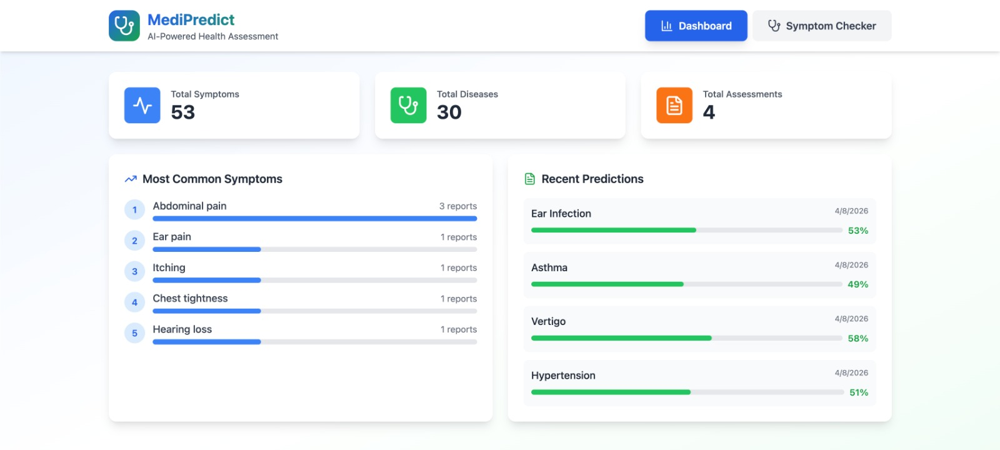
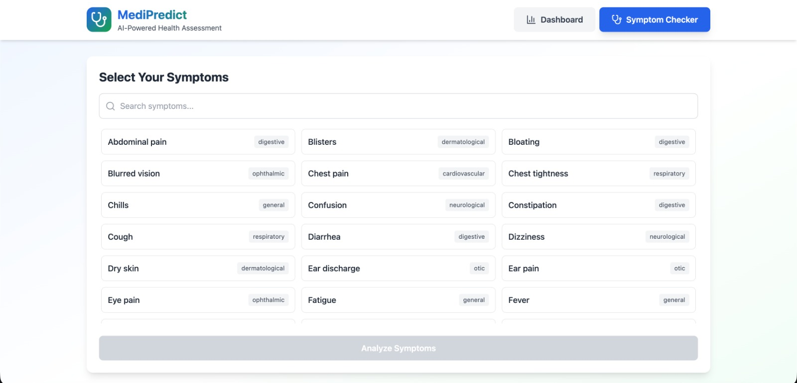
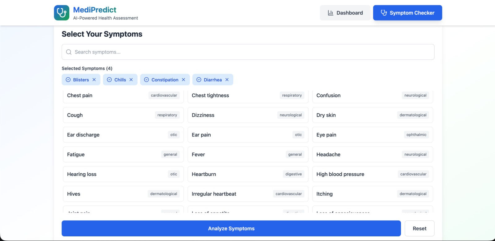
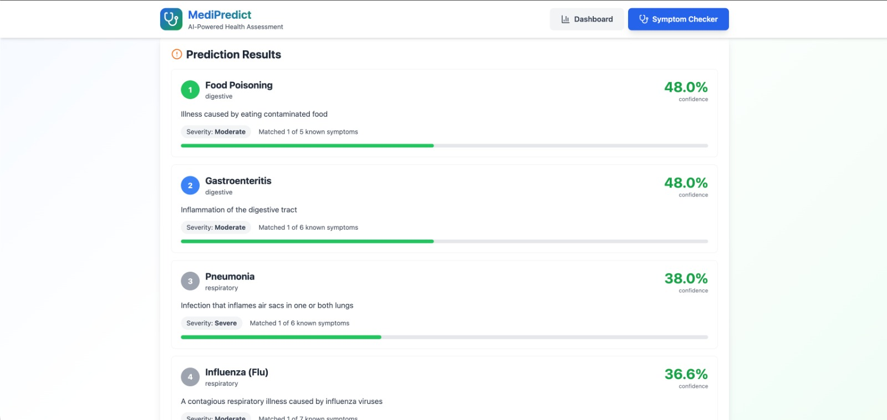

# AI-Based Symptom Checker & Disease Prediction System using Data Warehousing and Big Data Analytics

## Overview

This project presents a data-driven healthcare solution that leverages machine learning, cloud-based data warehousing, and large-scale data analytics to predict probable diseases based on user-provided symptoms.

The system integrates structured data storage, scalable processing, and analytical modeling to identify meaningful symptom-disease relationships. It enables early-stage disease awareness while delivering insights through visual analytics.

> ⚠️ Note: Model development was performed using Google Colab, while data warehousing and storage operations were implemented using Microsoft Azure services.

---

## Objectives

* Analyze large-scale healthcare datasets (~200,000+ records)
* Design and implement a cloud-based data warehousing solution
* Identify relationships between symptoms and diseases
* Build predictive machine learning models
* Generate insights using big data analytics and visualization techniques
* Develop a scalable and efficient healthcare analytics system

---

## Technologies Used

* R (Machine Learning & Analysis)
* Google Colab (Model Development)
* Microsoft Azure (Data Warehousing)
* Data Visualization Tools

---

## Methodology

### Data Warehousing (Azure Implementation)

A cloud-based data warehousing approach was used to efficiently store and manage large healthcare datasets.

* Data was structured and stored using **Azure SQL Database**
* Data ingestion and management were handled through Azure tools
* Query Editor and SQL operations were used for:

  * Data cleaning
  * Transformation
  * Aggregation
* Schema design ensured efficient querying and analytics
* Enabled scalable storage and faster data retrieval

This layer ensured proper organization of structured healthcare data before applying analytics and machine learning models.

---

### Data Processing & Big Data Analytics

* Data cleaning and preprocessing performed on large datasets
* Feature extraction and transformation for symptom representation
* Handling both real-world and synthetic datasets
* Analytical operations performed to identify:

  * Symptom frequency patterns
  * Disease correlations
  * Trend distributions

Big Data Analytics techniques were applied to extract meaningful insights from high-volume healthcare data.

---

### Machine Learning Models

* **Decision Tree**

  * Interpretable and rule-based classification
  * Effective for symptom-driven predictions

* **Naive Bayes**

  * Probabilistic model
  * Suitable for multi-symptom scenarios

---

### Evaluation Metrics

* Accuracy
* Precision
* Recall
* F1-Score
* Cross-validation

---

## Key Features

### Symptom-Based Prediction

* Accepts multiple symptoms as input
* Predicts probable diseases with confidence scores
* Provides ranked outputs based on likelihood

### Data Analytics & Insights

* Disease frequency distribution
* Symptom importance analysis
* Pattern and trend visualization
* Graphical representation of healthcare insights

---

## Dataset

* Public datasets (Kaggle, UCI Repository)
* Synthetic dataset generated using symptom-disease mappings

---

## Results

### Outputs

---

## Challenges

* Limited availability of structured medical datasets
* Noise in synthetic data affecting model accuracy
* Handling overlapping symptom conditions
* Data integration challenges in warehousing layer
* System is advisory and not a substitute for medical diagnosis

---

## Future Scope

* Integration with real-world clinical and hospital datasets
* Use of advanced models (Deep Learning, Ensemble Methods)
* Real-time data streaming and analytics
* Enhancement of Azure-based data pipelines
* Full-stack web and mobile application deployment

---

## Conclusion

This project demonstrates the integration of **data warehousing, big data analytics, and machine learning** to build a scalable healthcare prediction system.

The use of cloud-based warehousing (Azure) ensures efficient data management, while big data analytics enables extraction of meaningful insights from large datasets. Together, these technologies highlight how modern data-driven approaches can transform healthcare systems into more intelligent and accessible solutions.

---

